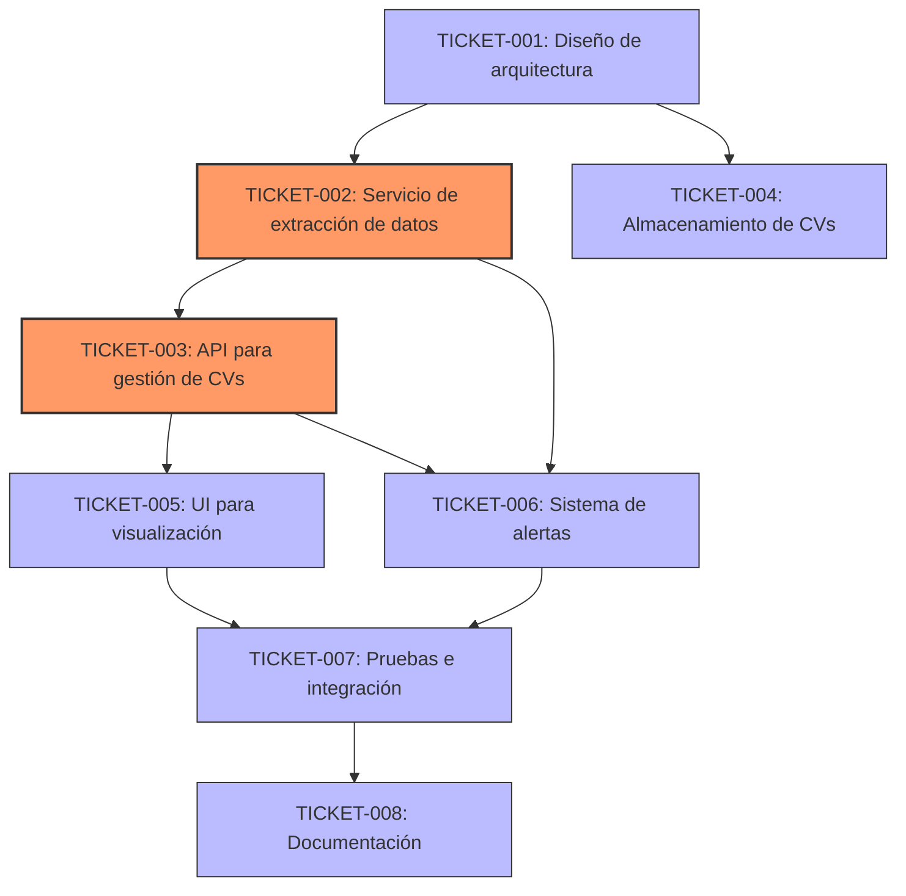

### Historias de Usuario para ATS Competitivo "LTI"
#### Bounded Context: Recruiting (Reclutamiento)
##### Prioridad Alta (Must-Have)
  1. Como reclutador, quiero crear y publicar vacantes para atraer talento calificado.
      - Criterios de aceptación:
          - Puedo crear una nueva vacante desde el panel de control
          - Puedo definir título, descripción, requisitos y beneficios
          - Puedo seleccionar categorías y etiquetas para mejor clasificación
          - Puedo establecer fecha de publicación y cierre
          - Puedo guardar borradores antes de publicar
 2. Como reclutador, quiero publicar vacantes en múltiples plataformas para maximizar el alcance.
      - Criterios de aceptación:
          - Puedo seleccionar LinkedIn, Google Jobs e Indeed para publicación
          - Recibo confirmación cuando la vacante se publica exitosamente
          - Puedo ver estadísticas de visualizaciones por plataforma
  3. Como gerente de contratación, quiero aprobar vacantes antes de su publicación.
      - Criterios de aceptación:
          - Recibo notificaciones de vacantes pendientes de aprobación
          - Puedo aprobar, rechazar o solicitar cambios
          - Puedo ver el historial de aprobaciones
  4. Como reclutador, quiero pausar o cerrar vacantes cuando sea necesario.
      - Criterios de aceptación:
          - Puedo cambiar el estado de una vacante a pausada o cerrada
          - Las vacantes pausadas/cerradas se actualizan en todas las plataformas
          - Puedo reactivar vacantes pausadas

#### Bounded Context: Application Management (Gestión de Candidatos)**
##### Prioridad Alta (Must-Have)
  1. Como candidato, quiero aplicar a vacantes con un clic desde LinkedIn o Google Jobs.
      - Criterios de aceptación:
          - Puedo postularme usando mi perfil de LinkedIn
          - El proceso requiere menos de 3 clics
          - Recibo confirmación inmediata de mi postulación
    
  2. Como reclutador, quiero filtrar y calificar candidatos para encontrar los mejores perfiles.
      - Criterios de aceptación:
          - Puedo filtrar por habilidades, experiencia y educación
          - Puedo ordenar candidatos por puntuación automática
          - Puedo agregar notas y calificaciones personalizadas
                
  3. Como reclutador, quiero revisar CVs procesados por IA para ahorrar tiempo.
      - Criterios de aceptación:
          - El sistema extrae automáticamente datos clave del CV
          - Puedo ver un resumen de habilidades y experiencia relevante
          - Recibo alertas de coincidencias destacadas con la vacante
          
  4. Como candidato, quiero recibir actualizaciones sobre mi proceso de selección.
      - Criterios de aceptación:
          - Recibo notificaciones cuando avanzo a la siguiente etapa
          - Puedo ver mi estado actual en el proceso
          - Recibo retroalimentación si no avanzo en el proceso

### Bounded Context: Evaluation & Interview (Evaluaciones y Entrevistas)
#### Prioridad Alta (Must-Have)
  1. Como reclutador, quiero programar entrevistas automáticamente basadas en disponibilidad.
      - Criterios de aceptación:
          - El sistema sugiere horarios basados en disponibilidad mutua
          - Las entrevistas se agregan automáticamente al calendario
          - Se envían recordatorios a todos los participantes
    
  2. Como candidato, quiero realizar pruebas en línea sin salir de la plataforma.
      - Criterios de aceptación:
          - Puedo acceder a evaluaciones técnicas y psicométricas
          - La interfaz es intuitiva y funciona en dispositivos móviles
          - Recibo instrucciones claras antes de cada prueba
        
  3. Como entrevistador, quiero acceder a perfiles completos de candidatos antes de entrevistas.
      - Criterios de aceptación:
          - Puedo ver CV, resultados de pruebas y notas previas
          - Tengo acceso a preguntas sugeridas basadas en el perfil
          - Puedo registrar mis evaluaciones después de la entrevista
                
  4. Como reclutador, quiero configurar flujos de evaluación personalizados por tipo de vacante.
      - Criterios de aceptación:
          - Puedo definir etapas específicas para cada tipo de posición
          - Puedo asignar evaluadores para cada etapa
          - Puedo establecer criterios de aprobación automáticos
            
### Bounded Context: Hiring & Offer Management (Contratación y Ofertas)
#### Prioridad Alta (Must-Have)
  1. Como reclutador, quiero generar ofertas laborales personalizadas para candidatos seleccionados.
      - Criterios de aceptación:
          - Puedo personalizar términos y condiciones
          - Las ofertas se generan con formato profesional
          - Puedo enviar ofertas directamente desde la plataforma

  2. Como gerente de contratación, quiero aprobar ofertas antes de enviarlas.
      - Criterios de aceptación:
          - Recibo notificaciones de ofertas pendientes
          - Puedo aprobar, rechazar o solicitar cambios
          - Puedo ver comparativas salariales para tomar decisiones

#### Prioridad Media (Should-Have)
  1. Como candidato, quiero firmar digitalmente mi contrato para agilizar el proceso.
      - Criterios de aceptación:
          - Puedo revisar y firmar documentos electrónicamente
          - El proceso cumple con requisitos legales
          - Recibo copia de documentos firmados

### Bounded Context: Analytics & Insights (Analítica y Reportes)
#### Prioridad Alta (Must-Have)
  1. Como reclutador, quiero ver métricas clave de reclutamiento en un dashboard.
      - Criterios de aceptación:
          - Puedo ver tiempo promedio de contratación
          - Puedo analizar tasas de conversión por etapa
          - Puedo identificar fuentes de reclutamiento más efectivas
          - Las métricas se actualizan en tiempo real
    
  2. Como gerente de contratación, quiero generar reportes personalizados sobre procesos de selección.
      - Criterios de aceptación:
          - Puedo filtrar datos por departamento, posición y período
          - Puedo exportar reportes en diferentes formatos
          - Los reportes incluyen visualizaciones claras

#### Prioridad Media (Should-Have)
  1. Como reclutador, quiero recibir predicciones de tiempos de contratación basadas en IA.
      - Criterios de aceptación:
          - El sistema predice tiempo estimado para cubrir vacantes
          - Las predicciones consideran datos históricos y tendencias
          - Recibo recomendaciones para optimizar procesos
    
## Consideraciones Técnicas y de Seguridad
#### Prioridad Alta (Must-Have)
  1. Como administrador del sistema, quiero garantizar el cumplimiento normativo (GDPR, EEOC).
      - Criterios de aceptación:
          - Los datos personales se almacenan de forma segura
          - Los candidatos pueden solicitar eliminación de datos
          - Se mantienen registros de auditoría de acceso a datos
        
  2. Como usuario del sistema, quiero acceder de forma segura a la plataforma.
      - Criterios de aceptación:
          - Autenticación mediante JWT y OAuth2
          - Datos sensibles cifrados con AES256
          - Sesiones con tiempo de expiración configurable
          - Monitoreo y alertas de actividades sospechosas
                
  3. Como administrador, quiero configurar roles y permisos para diferentes usuarios.
      - Criterios de aceptación:
          - Puedo crear roles personalizados
          - Puedo asignar permisos granulares por módulo
          - Los cambios de permisos se aplican inmediatamente

Estas historias de usuario están alineadas con los requisitos del cliente, las necesidades comerciales y las prioridades del  proyecto LTI, enfocándose primero en las funcionalidades "Must-Have" para el MVP y luego en las "Should-Have" para próximas  versiones.

 ## Backlog de Producto - ATS Competitivo "LTI"
 Como Product Owner, he colaborado con el equipo de desarrollo y los stakeholders para crear el siguiente backlog de producto basado en las historias de  usuario previamente definidas. Este backlog está priorizado según el valor de negocio, las necesidades del cliente y la viabilidad técnica.
 
 ## Release 1: MVP (Minimum Viable Product)
 
 ### Epic 1: Gestión de Vacantes
 **Valor de negocio**: Permite a los reclutadores crear y gestionar vacantes, base fundamental del sistema.
 
 | ID | Historia de Usuario | Estimación | Prioridad | Criterios de Aceptación | Asignado a |
 |----|---------------------|------------|-----------|-------------------------|------------|
 | US-001 | Como reclutador, quiero crear y publicar vacantes para atraer talento calificado | 8 | ALTA | • Formulario completo con todos los campos  necesarios<br• Validación de datos<br• Opción de guardar como borrador<br• Vista previa antes de publicar | Equipo Frontend/Backend |
 | US-002 | Como reclutador, quiero publicar vacantes en múltiples plataformas | 13 | ALTA | • Integración con LinkedIn, Google Jobs e Indeed<br•  Confirmación de publicación<br• Estadísticas de visualización por plataforma | Equipo de Integraciones |
 | US-003 | Como gerente de contratación, quiero aprobar vacantes antes de su publicación | 5 | ALTA | • Sistema de notificaciones<br• Interfaz de  aprobación/rechazo<br• Historial de cambios y aprobaciones | Equipo Backend |
 | US-004 | Como reclutador, quiero pausar o cerrar vacantes cuando sea necesario | 3 | ALTA | • Cambio de estado en todas las plataformas<br• Notificación  a candidatos activos<br• Opción de reactivación | Equipo Backend |
 
 ### Epic 2: Gestión de Candidatos
 **Valor de negocio**: Optimiza el proceso de recepción y evaluación de candidatos.
 
 | ID | Historia de Usuario | Estimación | Prioridad | Criterios de Aceptación | Asignado a |
 |----|---------------------|------------|-----------|-------------------------|------------|
 | US-005 | Como candidato, quiero aplicar a vacantes con un clic desde LinkedIn o Google Jobs | 13 | ALTA | • Integración con perfiles de LinkedIn<br•  Proceso de aplicación en menos de 3 clics<br• Confirmación inmediata | Equipo de Integraciones |
 | US-006 | Como reclutador, quiero filtrar y calificar candidatos | 8 | ALTA | • Filtros avanzados por habilidades, experiencia, etc.<br• Sistema de  puntuación automática<br• Notas y calificaciones personalizadas | Equipo Backend/Frontend |
 | US-007 | Como reclutador, quiero revisar CVs procesados por IA | 13 | ALTA | • Extracción automática de datos clave<br• Resumen de habilidades  relevantes<br• Coincidencia con requisitos de la vacante | Equipo IA/ML |
 | US-008 | Como candidato, quiero recibir actualizaciones sobre mi proceso de selección | 5 | ALTA | • Notificaciones por email/SMS<br• Portal de candidato  con estado actual<br• Retroalimentación automatizada | Equipo Backend |
 
 ### Epic 3: Evaluaciones y Entrevistas
 **Valor de negocio**: Facilita la evaluación objetiva de candidatos y optimiza el proceso de entrevistas.
 
 | ID | Historia de Usuario | Estimación | Prioridad | Criterios de Aceptación | Asignado a |
 |----|---------------------|------------|-----------|-------------------------|------------|
 | US-009 | Como reclutador, quiero programar entrevistas automáticamente | 8 | ALTA | • Integración con calendarios<br• Sugerencia de horarios  disponibles<br• Recordatorios automáticos | Equipo de Integraciones |
 | US-010 | Como candidato, quiero realizar pruebas en línea sin salir de la plataforma | 13 | ALTA | • Evaluaciones técnicas y psicométricas integradas<br•  Interfaz responsiva<br• Instrucciones claras | Equipo Frontend/Backend |
 | US-011 | Como entrevistador, quiero acceder a perfiles completos de candidatos | 5 | ALTA | • Vista consolidada de CV, pruebas y notas<br• Preguntas  sugeridas por IA<br• Formulario de evaluación post-entrevista | Equipo Frontend |
 | US-012 | Como reclutador, quiero configurar flujos de evaluación personalizados | 8 | ALTA | • Editor de flujos de trabajo<br• Asignación de  evaluadores<br• Criterios de aprobación configurables | Equipo Backend |
 
 ### Epic 4: Contratación y Ofertas
 **Valor de negocio**: Agiliza el proceso final de contratación y reduce el tiempo de incorporación.
 
 | ID | Historia de Usuario | Estimación | Prioridad | Criterios de Aceptación | Asignado a |
 |----|---------------------|------------|-----------|-------------------------|------------|
 | US-013 | Como reclutador, quiero generar ofertas laborales personalizadas | 8 | ALTA | • Plantillas personalizables<br• Formato profesional<br• Envío  directo desde la plataforma | Equipo Backend/Frontend |
 | US-014 | Como gerente de contratación, quiero aprobar ofertas antes de enviarlas | 5 | ALTA | • Notificaciones de ofertas pendientes<br• Interfaz de  aprobación<br• Comparativas salariales | Equipo Backend |
 
 ### Epic 5: Analítica y Reportes
 **Valor de negocio**: Proporciona insights para mejorar continuamente el proceso de reclutamiento.
 
 | ID | Historia de Usuario | Estimación | Prioridad | Criterios de Aceptación | Asignado a |
 |----|---------------------|------------|-----------|-------------------------|------------|
 | US-015 | Como reclutador, quiero ver métricas clave de reclutamiento en un dashboard | 8 | ALTA | • Tiempo promedio de contratación<br• Tasas de  conversión por etapa<br• Efectividad de fuentes de reclutamiento<br• Actualización en tiempo real | Equipo de Analítica |
 | US-016 | Como gerente de contratación, quiero generar reportes personalizados | 8 | ALTA | • Filtros por departamento, posición y período<br• Exportación  en múltiples formatos<br• Visualizaciones claras e interactivas | Equipo de Analítica |
 
 ### Epic 6: Seguridad y Cumplimiento
 **Valor de negocio**: Garantiza la protección de datos y el cumplimiento normativo.
 
 | ID | Historia de Usuario | Estimación | Prioridad | Criterios de Aceptación | Asignado a |
 |----|---------------------|------------|-----------|-------------------------|------------|
 | US-017 | Como administrador del sistema, quiero garantizar el cumplimiento normativo | 13 | ALTA | • Almacenamiento seguro de datos personales<br•  Mecanismo de eliminación de datos<br• Registros de auditoría | Equipo de Seguridad |
 | US-018 | Como usuario del sistema, quiero acceder de forma segura a la plataforma | 8 | ALTA | • Autenticación JWT/OAuth2<br• Cifrado AES256<br•  Sesiones con tiempo de expiración | Equipo de Seguridad |
 | US-019 | Como administrador, quiero configurar roles y permisos | 8 | ALTA | • Creación de roles personalizados<br• Permisos granulares por módulo<br•  Aplicación inmediata de cambios | Equipo Backend |
 
 ## Release 2: Mejoras Post-MVP
 
 ### Epic 7: Funcionalidades Avanzadas
 **Valor de negocio**: Añade características diferenciadoras que mejoran la experiencia de usuario.
 
| ID | Historia de Usuario | Estimación | Prioridad | Criterios de Aceptación | Asignado a |
|----|---------------------|------------|-----------|-------------------------|------------|
| US-020 | Como candidato, quiero firmar digitalmente mi contrato | 13 | MEDIA | • Integración con DocuSign o similar<br• Proceso legal compliant<br•  Almacenamiento seguro de documentos | Equipo de Integraciones |
| US-021 | Como reclutador, quiero recibir predicciones de tiempos de contratación basadas en IA | 13 | MEDIA | • Predicciones basadas en datos  históricos<br• Recomendaciones de optimización<br• Visualización de tendencias | Equipo IA/ML |
| US-022 | Como usuario, quiero utilizar la plataforma en múltiples idiomas | 8 | MEDIA | • Soporte para Español, Inglés y Portugués<br• Detección  automática de idioma<br• Traducción de contenido dinámico | Equipo Frontend |

## Detalles Técnicos

### Dependencias Técnicas
- Configuración de infraestructura en AWS/GCP
- Implementación de arquitectura de microservicios
- Integración con APIs externas (LinkedIn, Google Jobs, Indeed)
- Configuración de pipeline CI/CD

### Riesgos Identificados
1. **Integración con plataformas externas**: Las APIs de LinkedIn y Google Jobs pueden tener limitaciones o cambios que afecten la funcionalidad.
2. **Procesamiento de CV con IA**: La precisión del análisis puede variar según el formato y contenido de los CVs.
3. **Cumplimiento normativo**: Cambios en regulaciones de protección de datos pueden requerir ajustes en el sistema.

### Plan de Mitigación
1. Desarrollar adaptadores flexibles para las integraciones externas
2. Implementar feedback continuo para mejorar los algoritmos de IA
3. Diseñar la arquitectura con enfoque en privacidad desde el diseño (Privacy by Design)

## Roadmap de Releases

### Release 1: MVP (Q1 2023)
- Epics 1-6: Funcionalidades core del sistema
- Foco en experiencia de usuario fluida y funcionalidades esenciales

### Release 2: Mejoras Post-MVP (Q2 2023)
- Epic 7: Funcionalidades avanzadas
- Mejoras basadas en feedback de usuarios iniciales

### Release 3: Expansión (Q3 2023)
- Integraciones adicionales con sistemas de RRHH
- Funcionalidades avanzadas de IA predictiva
- Expansión a mercados internacionales

# Tickets de Trabajo para la Historia de Usuario US-007

Como equipo de desarrollo, hemos seleccionado la historia de usuario **US-007: Como reclutador, quiero revisar CVs procesados por IA para ahorrar tiempo** para desglosarla en tickets de trabajo técnicos durante nuestra reunión de planificación.

## Metodología de Estimación
Utilizaremos **Planning Poker con la secuencia de Fibonacci** (1, 2, 3, 5, 8, 13, 21) para estimar los puntos de historia, donde:
- 1 punto = tarea muy simple (menos de medio día)
- 5 puntos = tarea de complejidad media (2-3 días)
- 13 puntos = tarea compleja (una semana o más)

## Tickets de Trabajo

### TICKET-001: Diseño de la arquitectura del procesador de CV
**Descripción:** Definir la arquitectura del sistema de procesamiento de CV, incluyendo los componentes, flujos de datos y puntos de integración con servicios de IA.

**Tareas técnicas:**
- Diseñar diagrama de arquitectura del procesador de CV
- Definir interfaces entre componentes
- Documentar flujo de procesamiento de documentos
- Seleccionar servicios de IA para extracción de datos (OpenAI GPT, Azure Document Intelligence o similar)

**Criterios de aceptación:**
- Diagrama de arquitectura aprobado por el equipo técnico
- Documento de diseño con interfaces y contratos definidos
- Evaluación de servicios de IA completada con recomendación final

**Asignado a:** Arquitecto de Software  
**Estimación:** 5 puntos de historia  
**Dependencias:** Ninguna

### TICKET-002: Implementación del servicio de extracción de datos de CV
**Descripción:** Desarrollar el microservicio que se encargará de procesar los documentos PDF/Word y extraer información estructurada mediante IA.

**Tareas técnicas:**
- Crear microservicio en Node.js siguiendo Clean Architecture
- Implementar integración con API de procesamiento de documentos
- Desarrollar algoritmos de extracción de datos clave (experiencia, educación, habilidades)
- Implementar sistema de clasificación y puntuación de habilidades
- Crear tests unitarios y de integración

**Criterios de aceptación:**
- El servicio procesa correctamente documentos en formatos PDF, DOCX y TXT
- Extrae con precisión >85% los datos de experiencia laboral, educación y habilidades
- Tiempo de procesamiento <30 segundos por documento
- Cobertura de pruebas >80%

**Asignado a:** Equipo IA/ML  
**Estimación:** 13 puntos de historia  
**Dependencias:** TICKET-001

### TICKET-003: Desarrollo de API para gestión de CVs procesados
**Descripción:** Implementar los endpoints de API necesarios para subir, procesar y recuperar CVs procesados.

**Tareas técnicas:**
- Crear endpoints RESTful para subir documentos
- Implementar endpoint para obtener resultados de procesamiento
- Desarrollar endpoint para comparar CV con requisitos de vacante
- Implementar sistema de cola para procesamiento asíncrono
- Documentar API con Swagger/OpenAPI

**Criterios de aceptación:**
- API documentada y funcional según especificaciones
- Manejo correcto de errores y excepciones
- Procesamiento asíncrono implementado con Redis
- Pruebas de carga superadas (50 CVs simultáneos)

**Asignado a:** Equipo Backend  
**Estimación:** 8 puntos de historia  
**Dependencias:** TICKET-002

### TICKET-004: Implementación del almacenamiento de CVs y resultados
**Descripción:** Desarrollar el modelo de datos y la capa de persistencia para almacenar los CVs originales y los datos estructurados extraídos.

**Tareas técnicas:**
- Diseñar esquema de base de datos para CVs procesados
- Implementar repositorio para almacenamiento de documentos (S3 o similar)
- Desarrollar capa de acceso a datos con Prisma ORM
- Implementar mecanismos de caché para resultados frecuentes

**Criterios de aceptación:**
- Esquema de base de datos normalizado y optimizado
- Almacenamiento seguro de documentos con encriptación
- Consultas optimizadas para recuperación rápida
- Pruebas de integración exitosas

**Asignado a:** Equipo Backend  
**Estimación:** 5 puntos de historia  
**Dependencias:** TICKET-001

### TICKET-005: Desarrollo de interfaz de usuario para visualización de CVs procesados
**Descripción:** Crear los componentes de UI que permitirán a los reclutadores visualizar los CVs procesados y sus datos estructurados.

**Tareas técnicas:**
- Diseñar componentes React para visualización de CV
- Implementar vista de resumen con datos clave extraídos
- Desarrollar sistema de destacado de coincidencias con la vacante
- Crear componente de calificación y notas para el reclutador
- Implementar visualización del documento original

**Criterios de aceptación:**
- Interfaz intuitiva y responsive
- Visualización clara de datos extraídos vs. documento original
- Destacado visual de coincidencias con requisitos de la vacante
- Funcionalidad de zoom y navegación en documento original

**Asignado a:** Equipo Frontend  
**Estimación:** 8 puntos de historia  
**Dependencias:** TICKET-003

### TICKET-006: Implementación del sistema de alertas de coincidencias
**Descripción:** Desarrollar el sistema que analizará las coincidencias entre el CV procesado y los requisitos de la vacante, generando alertas para el reclutador.

**Tareas técnicas:**
- Implementar algoritmo de matching entre CV y requisitos
- Desarrollar sistema de puntuación de candidatos
- Crear mecanismo de notificaciones para coincidencias destacadas
- Implementar reglas de negocio para priorización de candidatos

**Criterios de aceptación:**
- Sistema de puntuación preciso basado en requisitos de la vacante
- Notificaciones generadas correctamente para coincidencias >80%
- Algoritmo capaz de identificar sinónimos y habilidades relacionadas
- Dashboard con candidatos ordenados por relevancia

**Asignado a:** Equipo IA/ML  
**Estimación:** 8 puntos de historia  
**Dependencias:** TICKET-002, TICKET-003

### TICKET-007: Pruebas de integración y optimización
**Descripción:** Realizar pruebas exhaustivas del sistema completo y optimizar el rendimiento del procesamiento de CV.

**Tareas técnicas:**
- Ejecutar pruebas end-to-end del flujo completo
- Realizar pruebas de carga y estrés
- Optimizar tiempos de procesamiento y consumo de recursos
- Implementar mejoras basadas en resultados de pruebas

**Criterios de aceptación:**
- Flujo completo funciona correctamente en entorno de pruebas
- Tiempo de procesamiento optimizado a <20 segundos por CV
- Sistema soporta procesamiento de 100 CVs por hora
- Informe de pruebas documentado y aprobado

**Asignado a:** Equipo QA  
**Estimación:** 5 puntos de historia  
**Dependencias:** TICKET-003, TICKET-005, TICKET-006

### TICKET-008: Documentación y capacitación
**Descripción:** Crear documentación técnica y de usuario, y preparar materiales de capacitación para reclutadores.

**Tareas técnicas:**
- Documentar arquitectura y componentes del sistema
- Crear guía de usuario para reclutadores
- Desarrollar material de capacitación
- Preparar FAQ y guía de solución de problemas

**Criterios de aceptación:**
- Documentación técnica completa y actualizada
- Guía de usuario con capturas de pantalla y ejemplos
- Material de capacitación aprobado por el equipo de RRHH
- Documentación disponible en el repositorio del proyecto

**Asignado a:** Equipo de Documentación  
**Estimación:** 3 puntos de historia  
**Dependencias:** TICKET-005, TICKET-006

## Resumen de Estimación

| Ticket | Descripción | Puntos de Historia |
|--------|-------------|-------------------|
| TICKET-001 | Diseño de la arquitectura del procesador de CV | 5 |
| TICKET-002 | Implementación del servicio de extracción de datos de CV | 13 |
| TICKET-003 | Desarrollo de API para gestión de CVs procesados | 8 |
| TICKET-004 | Implementación del almacenamiento de CVs y resultados | 5 |
| TICKET-005 | Desarrollo de interfaz de usuario para visualización de CVs procesados | 8 |
| TICKET-006 | Implementación del sistema de alertas de coincidencias | 8 |
| TICKET-007 | Pruebas de integración y optimización | 5 |
| TICKET-008 | Documentación y capacitación | 3 |
| **TOTAL** | | **55 puntos de historia** |

## Diagrama de Dependencias (Mermaid)

